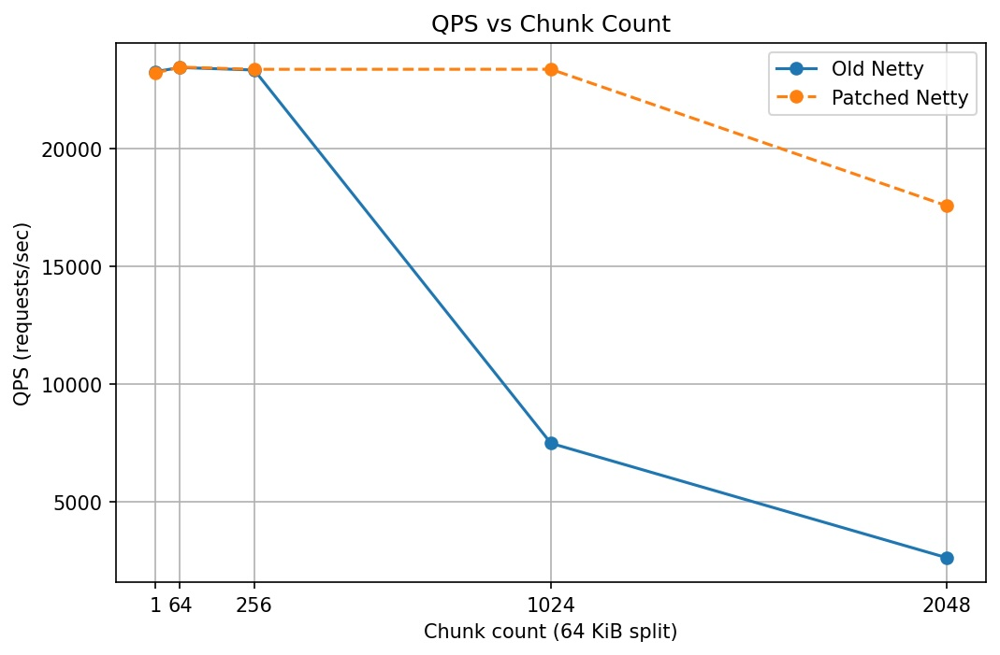

# IoUringSendZC

This repo compares a patched Netty build that enables `send_zc` (zero-copy send over io_uring) against the original Netty build. The goal is to quantify throughput for large responses and for workloads that aggregate many small buffers into batched sends (e.g., writev/sendmsg), and to provide a repeatable way to build and benchmark both variants.

## Build

The `build.sh` script produces two JARs from the same source tree:

- `IoUringSendZC_patch.jar`: built with the default profile (Netty 4.2.9.Final + send_zc patch).
- `IoUringSendZC_old.jar`: built with the `original-netty` profile (Netty 4.2.9.Final without the patch).

Run:

```bash
./build.sh
```

Under the hood it performs:

```bash
mvn clean package
mvn clean package -Poriginal-netty
```

## Benchmark

The benchmark uses `oha` with HTTP/1.1, 100 connections, and a 15-second fixed duration. Each request hits `/<count>` and returns a 64 KiB payload, and output files live under `benchmark/` with the naming pattern `*_64k_result.txt`. The `count` in the filename is not concurrency; it represents how the 64 KiB response is split into that many small chunks (`1`, `64`, `256`, `1024`, `2048`) to emulate workloads that batch many small buffers into a single send (writev/sendmsg-style).

### Test environment

- **Server**: AWS `m6i.4xlarge` (16 vCPU, 64 GiB), Linux kernel **6.12**
- **Load generator (oha)**: AWS `m6i.4xlarge` (4 vCPU, 16 GiB), Linux kernel **6.1**

### QPS (Requests/sec)

| Chunk count (64 KiB split) | Old Netty QPS | Patch QPS | Delta |
| --- | --- | --- | --- |
| 1 | 23,272.6 | 23,212.9 | -0.3% |
| 64 | 23,444.6 | 23,461.6 | +0.1% |
| 256 | 23,339.0 | 23,368.0 | +0.1% |
| 1024 | 7,492.0 | 23,370.4 | +212.0% (3.12x) |
| 2048 | 2,635.9 | 17,577.3 | +566.8% (6.67x) |


### Analysis

For low chunk counts (1–256), both builds are effectively flat at ~23.2k–23.5k QPS. This suggests the benchmark is not sensitive to the patched send path when the response is only split into a small number of pieces.

At higher chunk counts, the patched build is much more resilient. At 1024 chunks, throughput improves from ~7.5k QPS (old) to ~23.4k QPS (patch), a 3.12x gain. At 2048 chunks, it improves from ~2.6k QPS to ~17.6k QPS, a 6.67x gain.

These results indicate that the old path suffers substantial overhead/contension when a single response is split into many small buffers and then sent in batches (writev/sendmsg-style). The patch reduces that fragmentation-driven regression and makes throughput much less sensitive to buffer count.

In typical HTTP "header + body" workloads, sending a large payload is usually accompanied by one or more small header buffers. A strategy that switches to a zero-copy batched send based only on the *total* pending bytes can end up including very small buffers in the same zero-copy batch, which adds extra metadata and completion/notification handling overhead and limits the overall benefit.

The shape of the curve matches this: the old build collapses after 256 chunks, while the patched build stays near-flat up to 1024 and only degrades at 2048.

---

# 中文说明

本项目用于对比「启用 patch 的 Netty 版本」与「原始 Netty 版本」在大 payload 发送、以及大量小包聚合后批量发送场景下的吞吐表现，并提供可重复的构建和压测方式。

## 构建方式

运行 `build.sh` 会生成两个 JAR：

- `IoUringSendZC_patch.jar`：默认 profile（Netty 4.2.9.Final + send_zc 补丁）。
- `IoUringSendZC_old.jar`：`original-netty` profile（Netty 4.2.9.Final 原始实现）。

命令如下：

```bash
./build.sh
```

脚本实际执行：

```bash
mvn clean package
mvn clean package -Poriginal-netty
```

## 压测方式与结果

压测使用 `oha`：HTTP/1.1，100 并发连接，持续 15 秒。每个请求访问 `/count`，返回 64 KiB 数据；输出文件保存在 `benchmark/` 目录，并以 `*_64k_result.txt` 命名。这里的 `count` 不是并发数，而是把 64 KiB 响应拆成多少个小块（`1`、`64`、`256`、`1024`、`2048`）。该设置用于模拟大量小 buffer 聚合后通过 writev/sendmsg_zc 进行批量发送的负载。

### 测试环境

- **服务端**：AWS `m6i.4xlarge`（16c / 64g），Linux 内核 **6.12**
- **压测端（oha）**：AWS `m6i.4xlarge`（4c / 16g），Linux 内核 **6.1**

### QPS 结果与趋势


| Chunk count (64 KiB split) | Old Netty QPS | Patch QPS | Delta |
| --- | --- | --- | --- |
| 1 | 23,272.6 | 23,212.9 | -0.3% |
| 64 | 23,444.6 | 23,461.6 | +0.1% |
| 256 | 23,339.0 | 23,368.0 | +0.1% |
| 1024 | 7,492.0 | 23,370.4 | +212.0% (3.12x) |
| 2048 | 2,635.9 | 17,577.3 | +566.8% (6.67x) |


从表格和折线图可见，在低拆分数量（1-256）区间，patch 与旧版几乎相同，均维持在 23.2k-23.5k QPS 左右，差异极小，说明在“小包聚合程度不高”的场景下该 patch 对吞吐影响不明显。

当拆分数量提高到 1024 时，旧版吞吐明显下降到约 7.5k QPS，而 patch 仍保持在 23.4k QPS 左右，提升约 3.12 倍。拆分数量为 2048 时差异进一步扩大：旧版约 2.6k QPS，patch 约 17.6k QPS，提升约 6.67 倍。这说明在“header + body 混合”的大多数 HTTP 负载里，如果把大量很小的 buffer 也一并纳入 zerocopy 批量发送，会引入额外的元数据/回收通知处理开销，从而限制整体收益。

旧版策略更接近：

> 当总大小超过零拷贝阈值时，批处理中的所有缓冲区都将通过 sendmsg_zc 发送，包括 HTTP 标头等非常小的缓冲区

该 patch 的目标是让 zerocopy 相关发送更倾向于覆盖满足阈值的“大 buffer”，而小 buffer 继续走普通发送路径，从而改善“大量小包聚合批量发送”场景下的退化。

整体曲线形态也支持上述观察：旧版在拆分数量超过 256 后快速坍塌，patch 则直到 1024 仍保持稳定，仅在 2048 才出现明显下降。
